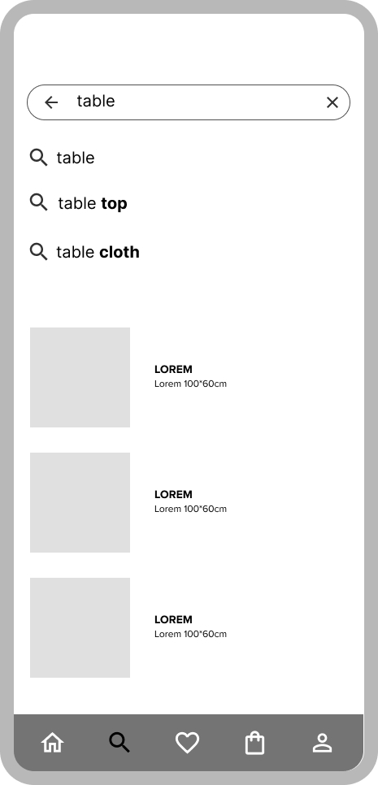

# Mobile Application Wireframes

Welcome to the Mobile Application Wireframes repository! This repository contains the wireframes for a mobile application that I have designed. These wireframes serve as a visual guide to the structure and functionality of the application, providing a clear overview of each key screen.

## Wireframes

### 1. Logo Frame
- **Description:** This frame represents the initial splash screen displaying the application's logo.

### 2. Login
- **Description:** This screen allows users to log in to their account using their credentials or google , Facebook account

### 3. Sign Up
- **Description:** New users can create an account through this sign-up screen.

### 4. Home
- **Description:** The home screen serves as the main landing page after logging in, providing an overview of the application’s main features.

### 5. Search Page
- **Description:** This screen allows users to search for items , it provides picture on search screen and suggesions  

### 6. Buy Page
- **Description:** Users can view and purchase items from this screen.

## Images

Below are the wireframes for each screen:

 
 

## How to Use

These wireframes can be used as a reference for developing the mobile application. They provide a visual outline that can be followed during the design and development process.

## Contribution

If you have suggestions or improvements, feel free to fork this repository and create a pull request. Contributions are always welcome!

## License

This project is licensed under the MIT License.
